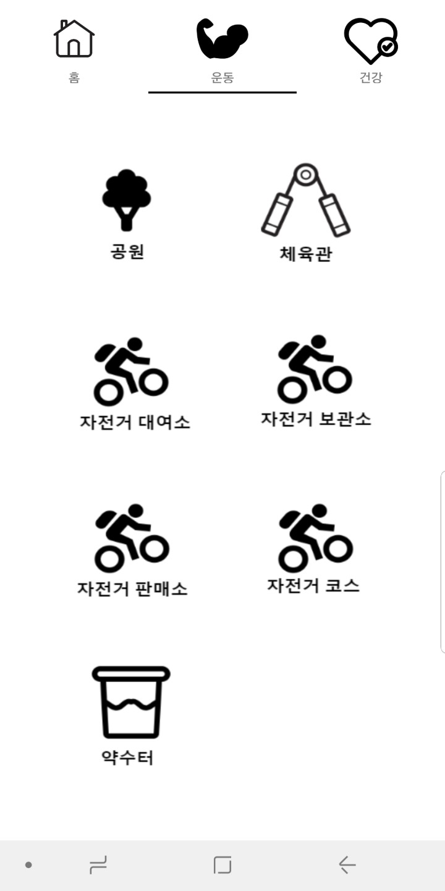

OpenApi를 활용한 건강 정보 APP
=====================

Description
------------
전주시 공공데이터를 활용하여 시민들에게 운동 장소 및 건강 관련 기관 정보를 제공하는 애플리케이션입니다.

총 6가지의 API와 7가지의 XML DATA를 파싱하여 제공합니다. 

- 활용 공공 데이터(API) : 공원 정보, 체육시설, 자전거 보관, 자동심장충격기 현황 정보, 병원,약국 정보
- 활용 공공 데이터(DATA) : 자전거보관소, 자전거판매소,치매센터,건강증진센터,의료기기 판매업소, 무더위 쉼터, 지정약수터

Period
-------
2018.11-2018.11 ( 약 2주 )

Release
-------
https://play.google.com/store/apps/details?id=example.com.jeonjuhealth

Role
----
안드로이드 개발

Language
---------
Android(Java)

Tool
-----
Android studio

Develop
-------

UI
---

 |  |  | 

 |  |  | 

Testing
-----
